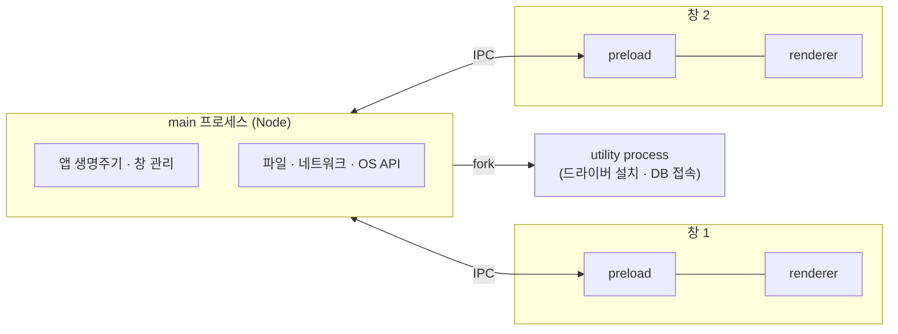
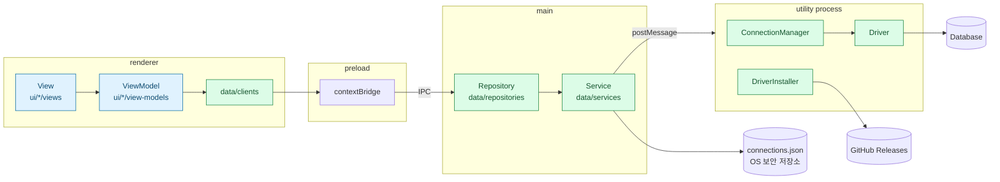

# data pump

> [!WARNING]
> **베타 버전입니다.** 아직 개발 중이라 데이터 손실이나 예기치 않은 동작이 일어날 수 있습니다. **운영(실) 환경의 데이터베이스에는 절대 연결하지 마세요.** 로컬이나 테스트용 데이터베이스에서만 사용하세요.

data pump는 여러 데이터베이스에 접속해 데이터를 조회하고 다루는 Electron 기반 데스크톱 DB 클라이언트입니다.

- **접속 관리**: DB 접속 정보를 저장해 두고 다시 사용할 수 있습니다. 비밀번호는 평문으로 두지 않고 OS 보안 저장소(macOS 키체인 등)를 이용해 암호화해 저장합니다.
- **드라이버 동적 설치**: DB 드라이버를 앱에 미리 넣지 않습니다. 사용자가 고른 DB의 드라이버만 GitHub Releases에서 내려받고, 서명된 manifest와 체크섬으로 검증한 뒤 설치합니다.
- **SQL 작업 공간**: 접속하면 바로 SQL 에디터에서 쿼리를 작성할 수 있습니다.

현재 MySQL을 지원하며, SQLite와 테이블 탐색 화면은 개발 중입니다.

## 설치

[Releases](https://github.com/dimsssss/data-pump/releases/latest)에서 `data-pump-<버전>-mac-<arch>.dmg`를 받아 열고, `data pump.app`을 Applications 폴더로 끌어다 놓습니다. 현재는 macOS 빌드만 배포하며, 릴리스의 "Source code"는 받지 않아도 됩니다.

앱이 Apple 공증을 받지 않아 처음 실행하면 "Apple은 'data pump'에 악성 코드가 없음을 확인할 수 없습니다" 경고가 뜹니다. 경고 창에서 **완료**를 누른 뒤 **시스템 설정 → 개인정보 보호 및 보안**의 보안 항목에서 **그래도 열기**를 누르면, 이후에는 바로 열립니다. 터미널에서는 다음 명령으로 같은 효과를 낼 수 있습니다.

```bash
xattr -dr com.apple.quarantine "/Applications/data pump.app"
```

## 배포

macOS 빌드는 macOS에서 다음 명령으로 배포합니다. 릴리스에는 빌드된 앱(dmg)과 sha256 체크섬만 올립니다.

```bash
pnpm release:mac            # apps/desktop/package.json의 version으로 v<version> 릴리스 생성
pnpm release:mac --dry-run  # 빌드만 하고 업로드하지 않음 (산출물: apps/desktop/out/release)
```

- 배포 전에 `apps/desktop/package.json`의 `version`을 올리고, main을 push해 public 저장소에 동기화된 상태여야 합니다. 릴리스 태그는 그 커밋을 가리킵니다.
- 아키텍처는 기본으로 현재 머신을 따르며, `ARCH=x64 pnpm release:mac`처럼 바꿀 수 있습니다.

## 프로젝트 구조

pnpm 워크스페이스로 구성한 모노레포입니다. 자세한 설계와 결정 이유는 [docs/architecture.md](docs/architecture.md)에 정리했습니다.

```
data-pump/
├── apps/
│   └── desktop/              Electron 데스크톱 앱
│       ├── main.ts           main 진입점: 앱 생명주기, 창, data layer 조립과 IPC 연결
│       ├── preload.ts        preload 진입점: ui가 data에 접근하는 데 필요한 API만 노출
│       ├── main.driver.ts    utility process 진입점: 드라이버 설치·DB 접속
│       └── src/
│           ├── ui/           UI layer (기능 단위): <기능>/views, <기능>/view-models
│           └── data/         Data layer (종류 단위): clients, repositories, services
├── packages/
│   ├── components/           공용 React 컴포넌트
│   ├── utils/                접속·드라이버 로직과 renderer와 공유하는 타입
│   │   └── src/
│   │       ├── connection/   ConnectionManager, ConnectionStorageService, driver/
│   │       └── installer/    드라이버 다운로드·서명 검증·로드
│   ├── conventions/          공용 ESLint·Prettier 설정
│   └── drivers/              DB 드라이버 번들 빌드·서명 (CI 전용)
└── docs/                     설계 문서
```

| 패키지                 | 역할                                                                                                               |
| ---------------------- | ------------------------------------------------------------------------------------------------------------------ |
| `apps/desktop`         | 화면(ui)과 데이터 접근(data)을 레이어로 나눈 Electron 앱입니다.                                                    |
| `packages/components`  | 특정 화면에 묶이지 않는 UI 컴포넌트입니다.                                                                         |
| `packages/utils`       | main·utility process에서 쓰는 로직(`index.ts`)과 renderer에서도 안전한 타입(`client.ts`)을 입구로 나눠 제공합니다. |
| `packages/conventions` | 모든 패키지가 공유하는 lint·포맷 설정입니다.                                                                       |
| `packages/drivers`     | 앱에 포함하지 않는 DB 드라이버를 번들링하고 서명해 GitHub Releases로 배포합니다.                                   |

## 애플리케이션 구조

electron을 사용해야 하기 때문에 어느 정도 강제된 부분이 있습니다. electron은 chromium의 멀티 프로세스 구조를 그대로 채택하고 있습니다. 하나의 메인 프로세스가 앱 전체를 관리하고, 창(탭)을 추가할 때마다 새로운 렌더러 프로세스가 생성되는 구조입니다.
개별 렌더러는 서로 다른 프로세스이기 때문에 한 화면에서 발생한 오류가 다른 화면으로 전파되지 않습니다. 다만 메인 프로세스가 종료되면 모든 창이 함께 종료되므로, 메인 프로세스는 안정성을 가장 우선해야 합니다.
electron은 이 구조 위에 메인 프로세스의 Node.js 통합과 preload 스크립트를 추가하여 main, preload, renderer라는 세 요소로 앱을 구성합니다.

main은 메인 프로세스에서 실행되는 코드로, 창 생성과 앱 생명주기 관리, 그리고 파일 시스템·네트워크·OS API 같은 외부 시스템 접근을 담당합니다. preload는 renderer가 main과 IPC로 통신할 수 있도록 필요한 API만 안전하게 노출하는 스크립트입니다. renderer는 화면을 그리고 사용자 입력을 받는 코드입니다.
그림으로 나타내면 다음과 같습니다.



DB 드라이버처럼 오래 걸리거나 죽을 수 있는 작업은 main이 아닌 utility process에서 실행해, 메인 프로세스의 안정성을 지킵니다.

다만 이 세 요소는 보안과 격리를 위한 런타임 경계일 뿐, 코드의 책임을 나누는 논리적 레이어와 1:1로 대응하지는 않습니다. 그래서 프로세스 경계는 electron의 제약으로 그대로 따르되, 책임 분리는 MVVM 아키텍처를 기준으로 다음과 같이 배치했습니다.

- UI layer (renderer): View와 ViewModel이 모두 renderer에 위치합니다. View는 화면을 그리고 사용자 이벤트를 ViewModel에 전달하며, 비즈니스 로직은 갖지 않습니다. ViewModel은 화면에 필요한 상태를 보관하고, 데이터를 화면에 맞게 가공하며, View가 호출할 command를 노출합니다. View와 ViewModel은 기능 단위로 1:1 관계를 가집니다.
- Service 인터페이스 (preload, data/clients): preload는 main 프로세스라는 데이터 소스로 가는 통로를 감싸는, 상태를 갖지 않는 어댑터입니다. renderer 쪽에서는 `data/clients`가 preload가 노출한 API를 감쌉니다. ViewModel은 clients를 통해서만 main에 접근하므로, renderer는 IPC의 구체적인 구현을 알 필요가 없습니다.
- Data layer (main): Repository와 Service가 main에 위치합니다. Service는 파일 시스템, 네트워크, OS API 같은 외부 데이터 소스를 상태 없이 감싸고, Repository는 이를 이용해 캐싱·에러 처리·재시도 등을 담당하며 앱 데이터의 source of truth 역할을 합니다.

main 프로세스의 창 생성과 앱 생명주기 관리는 MVVM의 범위 밖에 있는 electron 고유의 책임이므로, data layer와 별도의 모듈로 분리했습니다.

디렉터리는 프로세스가 아니라 레이어 기준으로 나눕니다. electron 고유의 코드는 루트의 진입점(`main.ts`, `preload.ts`, `main.driver.ts`)에만 두고, `src/` 안에는 `ui/`와 `data/`만 둡니다. 레이어와 프로세스의 관계를 요약하면 다음과 같습니다.



의존 방향은 `View → ViewModel → data/clients → (preload, IPC) → Repository → Service` 한 방향이며, 루트의 `eslint.config.js`가 반대 방향 import와 renderer 코드의 Node·Electron 모듈 사용을 막습니다. 레이어별 책임, 요청 흐름, lint 규칙 전체는 [docs/architecture.md](docs/architecture.md)를 참고하세요.

이렇게 electron이 강제하는 프로세스 구조는 유지하면서, 각 코드의 책임은 MVVM의 관심사 분리 원칙에 맞게 나누도록 앱을 설계했습니다.

참고 링크

- https://www.electronjs.org/docs/latest/
- https://docs.flutter.dev/app-architecture/guide

## 개발 노트

개발하면서 겪은 이슈와 해결 과정, 인상 깊었던 점을 기록합니다.

### Electron(macOS)에서 네이티브 `<select>` 선택이 늦게 반영되는 문제

DB 종류를 고르는 `<select>`에서 항목을 선택한 뒤 화면에 반영되기까지 1~2초가 걸렸습니다. `<div>`로 만든 커스텀 드롭다운으로 바꿔 해결했습니다.

자세한 과정: [electron 환경에서 select box 속도 지연](https://dimsss.notion.site/electron-select-box-3ece0b2007b58099953ddac41b8e30c6)

## 파일 이름 규칙

파일 이름은 그 파일의 대표 export를 따릅니다.

| 대표 export                             | 표기                            | 예시                                                                                    |
| --------------------------------------- | ------------------------------- | --------------------------------------------------------------------------------------- |
| React 컴포넌트, 클래스, 타입·인터페이스 | PascalCase (export 이름과 동일) | `Button.tsx`, `ConnectionManager.ts`, `DriverName.ts`                                   |
| React 훅                                | camelCase, `use` 접두어         | `useConnectionViewModel.ts`                                                             |
| 함수 모음, 객체 인스턴스, 스크립트      | kebab-case                      | `checksum.ts`, `mysql-driver.ts`, `connection-client.ts`, `sign-manifest.mjs`           |
| 프로세스 진입점, 도구 설정, 전역 선언   | 각 도구의 관례                  | `main.ts`, `preload.ts`, `main.driver.ts`, `forge.config.ts`, `global.d.ts`, `index.ts` |

- 테스트 파일은 대상 소스 파일과 같은 이름에 `.test.ts`를 붙이고, `test/` 아래에 `src/`와 같은 디렉터리 구조로 둡니다.
- 공용 컴포넌트(`packages/components`)는 특정 화면에 묶이지 않는 이름을 씁니다. 화면 이름 접두어(`Connection…`)는 그 화면 전용 컴포넌트에만 붙입니다.
