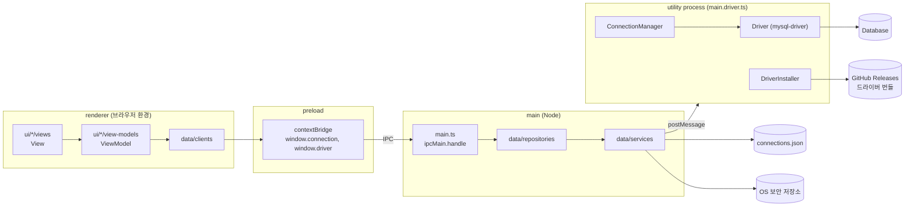
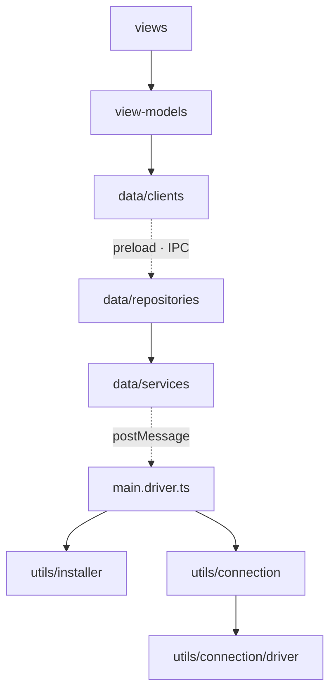
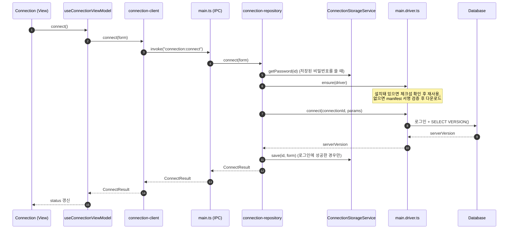

# 아키텍처 설계

data pump 데스크톱 앱의 코드 구조와 그렇게 나눈 이유를 기록합니다. README의 "프로젝트 구조", "애플리케이션 구조"는 이 문서를 요약한 것입니다.

참고 문서

- Electron 프로세스 모델: https://www.electronjs.org/docs/latest/tutorial/process-model
- Flutter 앱 아키텍처 가이드: https://docs.flutter.dev/app-architecture/guide

## 1. 설계 원칙

1. **프로세스 경계는 Electron을 따르고, 책임 분리는 MVVM을 따른다.**
   Electron의 main, preload, renderer, utility process는 보안과 격리를 위한 런타임 경계입니다. 코드의 책임은 Flutter 앱 아키텍처 가이드의 MVVM 레이어(UI layer, Data layer)로 나눕니다.
2. **디렉터리는 프로세스가 아니라 레이어로 나눈다.**
   `src/` 아래에는 `ui/`와 `data/`만 둡니다. Electron을 몰라도 디렉터리 이름만으로 코드의 책임을 알 수 있게 하기 위해서입니다.
3. **Electron 고유의 코드는 진입점에만 둔다.**
   앱 생명주기, 창 생성, preload, utility process 진입점은 MVVM 범위 밖의 Electron 고유 책임이므로 `apps/desktop/` 루트의 진입점 파일에 모읍니다.
4. **의존은 한 방향으로만 흐른다.**
   상위 레이어는 바로 아래 레이어만 사용하고, 하위 레이어는 상위를 모릅니다. 이 규칙은 문서가 아니라 lint 규칙(`eslint.config.js`)으로 강제합니다.
5. **renderer에는 필요한 API만 노출한다.**
   Electron 문서의 권고에 따라 preload는 `contextBridge`로 기능 단위 API만 노출하고, `ipcRenderer` 같은 권한이 큰 객체는 노출하지 않습니다.

## 2. 프로세스와 레이어



| 레이어        | 위치                         | 실행 프로세스 | 책임                                                                                                                   |
| ------------- | ---------------------------- | ------------- | ---------------------------------------------------------------------------------------------------------------------- |
| View          | `src/ui/<기능>/views/`       | renderer      | 화면을 그리고 사용자 이벤트를 ViewModel에 전달합니다. 비즈니스 로직은 갖지 않습니다.                                   |
| ViewModel     | `src/ui/<기능>/view-models/` | renderer      | 화면 상태를 보관하고, 데이터를 화면에 맞게 가공하며, View가 호출할 command를 노출합니다. View와 기능 단위로 1:1입니다. |
| Client        | `src/data/clients/`          | renderer      | preload가 노출한 API를 감싸는, ui가 data에 접근하는 유일한 입구입니다. ViewModel은 IPC의 구현을 모릅니다.              |
| (다리)        | `preload.ts`                 | preload       | renderer가 호출할 수 있는 API만 `contextBridge`로 노출합니다.                                                          |
| Repository    | `src/data/repositories/`     | main          | 앱 데이터의 source of truth입니다. 여러 Service를 조합해 하나의 흐름(예: 접속)을 완성합니다.                           |
| Service       | `src/data/services/`         | main          | 파일, OS 보안 저장소, 드라이버 프로세스 같은 외부 소스 하나를 상태 없이 감쌉니다.                                      |
| 생명주기      | `main.ts`                    | main          | 앱 생명주기와 창을 관리하고, data layer를 조립해 IPC 핸들러로 연결합니다.                                              |
| 드라이버 작업 | `main.driver.ts`             | utility       | 드라이버 설치와 DB 세션을 맡습니다. DB 드라이버가 죽거나 오래 걸려도 main이 영향을 받지 않도록 별도 프로세스로 둡니다. |

## 3. 디렉터리 구조

### 3.1 모노레포

```
data-pump/
├── apps/
│   └── desktop/            Electron 데스크톱 앱
├── packages/
│   ├── components/         공용 React 컴포넌트 (화면에 묶이지 않는 UI)
│   ├── utils/              main·utility process용 로직과 renderer와 공유하는 타입
│   ├── conventions/        공용 ESLint·Prettier 설정
│   └── drivers/            DB 드라이버 번들 빌드·서명 스크립트 (CI 전용, 워크스페이스에서 제외)
├── docs/                   설계 문서
└── eslint.config.js        레이어 의존 규칙을 포함한 lint 설정
```

### 3.2 apps/desktop

```
apps/desktop/
├── main.ts                 main 진입점: 앱 생명주기, 창, data layer 조립, IPC 연결
├── preload.ts              preload 진입점: contextBridge로 필요한 API만 노출
├── main.driver.ts          utility process 진입점: 드라이버 설치·DB 접속 요청 처리
└── src/
    ├── main.tsx            화면 진입점 (index.html이 로드)
    ├── global.d.ts         preload가 노출한 window API 타입
    ├── ui/                 UI layer — 기능 단위로 나눈다
    │   ├── App.tsx         화면 전환 (접속 설정 ↔ 작업 화면)
    │   ├── connection/
    │   │   ├── views/
    │   │   └── view-models/
    │   └── workspace/
    │       └── views/
    └── data/               Data layer — 종류 단위로 나눈다
        ├── clients/        connection-client.ts, driver-client.ts
        ├── repositories/   connection-repository.ts
        └── services/       driver-process.ts, secret-store.ts
```

- UI layer는 Flutter 가이드처럼 **기능 단위**로 나눕니다. 화면 하나와 ViewModel 하나가 같은 기능 디렉터리에 있습니다.
- Data layer는 **종류 단위**로 나눕니다. Repository와 Service는 여러 화면이 함께 쓰기 때문입니다.
- 진입점 세 파일은 루트에 둡니다. Electron Forge의 Vite 플러그인이 진입점 파일 이름으로 빌드 결과물 이름(`main.js`, `preload.js`, `main.driver.js`)을 정하기 때문에, 디렉터리를 옮기더라도 파일 이름은 서로 달라야 합니다. `package.json`의 `main`과 `main.ts`의 preload·fork 경로가 이 이름에 의존합니다.

### 3.3 packages/utils

```
packages/utils/
├── index.ts                main·utility process 전용 입구 (Node 모듈 사용)
├── client.ts               renderer에서도 안전한 입구 (타입만, Node 의존성 없음)
└── src/
    ├── connection/         접속 단위로 작업을 처리하는 상위 계층
    │   ├── ConnectionManager.ts         connectionId별 DB 세션 관리 (utility process)
    │   ├── ConnectionStorageService.ts  저장된 접속 정보 파일 읽기·쓰기, 비밀번호 암호화 (main)
    │   └── driver/                      DB와 직접 통신하는 하위 계층 (connection 내부 구현)
    │       ├── Driver.ts                ConnectParams, DriverSession, Driver 인터페이스
    │       ├── mysql-driver.ts
    │       └── index.ts                 DRIVERS 목록
    └── installer/          드라이버 번들 다운로드·검증·로드 (connection과 독립)
        ├── DriverInstaller.ts
        ├── checksum.ts
        ├── download.ts
        └── manifest.ts
```

- 모든 DB 요청은 `ConnectionManager → Driver` 순서로 흐릅니다. 그래서 `driver/`는 `connection/`의 내부 구현으로 두고, 패키지 입구(`index.ts`)에서도 내보내지 않습니다.
- `installer/`와 `connection/`은 서로를 모릅니다. 둘은 `main.driver.ts`에서 `new ConnectionManager((name) => installer.load(name))`로 조립합니다.

## 4. 의존 규칙



`eslint.config.js`의 `no-restricted-imports`가 아래 규칙을 강제합니다.

| 대상                             | 금지하는 import                                                                          | 이유                                                                  |
| -------------------------------- | ---------------------------------------------------------------------------------------- | --------------------------------------------------------------------- |
| `src/ui/**`, `src/main.tsx`      | `data/repositories`, `data/services`, `electron`, `node:*`, `@packages/utils`(루트 입구) | renderer에서 실행되므로 Node 코드가 섞이면 깨집니다.                  |
| `src/ui/**/views/**`             | `data/` 전체                                                                             | View는 ViewModel을 통해서만 데이터에 접근합니다.                      |
| `src/data/clients/**`            | `repositories`, `services`, `ui/`, `electron`, `node:*`, `@packages/utils`               | renderer에서 실행되며, main 쪽 데이터에는 preload API로만 접근합니다. |
| `src/data/repositories/**`       | `ui/`, `clients/`                                                                        | 하위 레이어는 상위를 모릅니다.                                        |
| `src/data/services/**`           | `repositories`, `ui/`, `clients/`                                                        | Repository → Service 방향만 허용합니다.                               |
| `utils/src/installer/**`         | `connection`                                                                             | installer와 connection은 독립입니다.                                  |
| `utils/src/connection/*.ts`      | `installer`, `./driver/<파일>`                                                           | 드라이버 모듈은 주입받고, driver는 입구(`./driver`)로만 사용합니다.   |
| `utils/src/connection/driver/**` | 상위 `connection` 파일, `installer`                                                      | 하위 계층은 상위를 모릅니다.                                          |
| `utils/index.ts`                 | `connection/driver`                                                                      | driver는 connection을 통해서만 사용합니다.                            |
| `utils/client.ts`                | `node:*`, 상대 경로                                                                      | renderer에서 쓰이는 입구라 Node 코드가 섞이면 안 됩니다.              |

## 5. 요청 흐름: 접속(Connect)



- 단계별 진행 상황(`driver`, `login`, `save`)과 드라이버 다운로드 진행률은 main이 `connection:progress`, `driver:progress` 이벤트로 renderer에 보냅니다.
- 복호화한 비밀번호는 main 밖으로 보내지 않습니다. renderer는 저장 여부(`hasPassword`)만 받습니다.

## 6. 드라이버 배포

DB 드라이버(mysql2 등)는 앱에 포함하지 않고, 필요할 때 내려받습니다.

1. CI(`.github/workflows/drivers.yaml`)가 `packages/drivers`에서 드라이버를 esbuild로 번들링하고 실제 DB에 붙여 smoke test를 합니다.
2. 번들 목록과 sha256을 담은 manifest를 Ed25519로 서명해 GitHub Releases에 올립니다.
3. 앱의 `DriverInstaller`는 앱에 포함된 공개키(`TRUSTED_KEYS`)로 manifest 서명을 확인하고, 만료와 롤백(sequence 감소)을 거부한 뒤, 번들을 내려받아 체크섬을 검증합니다. 로드하기 직전에도 체크섬을 다시 확인합니다.

## 7. 설계 결정 기록

| 결정                                                                          | 이유                                                                                                                                                      |
| ----------------------------------------------------------------------------- | --------------------------------------------------------------------------------------------------------------------------------------------------------- |
| `DriverManager` → `DriverInstaller`                                           | 실제 역할이 드라이버 설치·검증·로드였습니다. JDBC의 `DriverManager`처럼 접속까지 하는 것으로 오해하기 쉬웠습니다.                                         |
| `DriverAdapter` → `Driver`, `connection/driver/`로 이동                       | DB와 직접 통신하는 하위 계층입니다. 모든 요청이 connection을 거치므로 connection의 내부 구현으로 둡니다.                                                  |
| installer는 connection과 같은 높이에 둠                                       | installer는 접속과 무관하게 따로 호출되고(`install`, `ensure`), connection은 installer를 직접 모릅니다.                                                   |
| utils `ConnectionRepository` → `ConnectionStorageService`                     | 파일 하나를 감싸는 역할이라 Flutter 가이드의 Service에 해당합니다. 여러 Service를 조합하는 desktop의 `connection-repository.ts`가 Repository입니다.       |
| desktop을 프로세스(`main/`, `renderer/`)가 아닌 레이어(`ui/`, `data/`)로 나눔 | 디렉터리 이름이 Electron에 묶이지 않게 하기 위해서입니다. 대신 `data/` 안에 renderer 코드(`clients/`)와 main 코드가 함께 있으므로 lint로 경계를 지킵니다. |
| 진입점 세 파일은 루트에 유지                                                  | Forge 빌드 결과물 이름이 진입점 파일 이름을 따르기 때문입니다.                                                                                            |
| preload에서 `ipcRenderer`, `versions` 노출 제거                               | Electron 보안 권고에 따라 기능 단위 API만 노출합니다. 사용하는 곳도 없었습니다.                                                                           |

## 8. 남은 과제

- DB 접속에 TLS 옵션이 없습니다. 접속 폼의 SSL 모드부터 `mysql-driver.ts`의 `ssl` 옵션까지 추가해야 합니다.
- `driver:install` IPC 핸들러는 Repository 없이 Service를 바로 호출합니다. 드라이버 관리 화면이 생기면 Repository를 둡니다.
- tsconfig가 하나라 renderer 코드에서 Node 타입을 써도 컴파일 오류가 나지 않습니다. 지금은 lint가 막고 있고, 필요하면 renderer용과 main용 tsconfig를 나눕니다.
